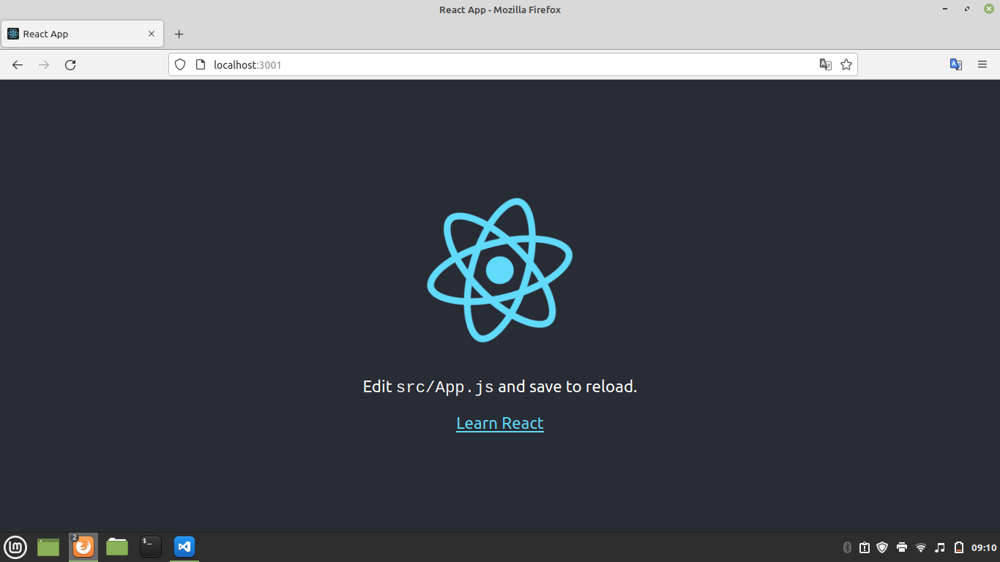
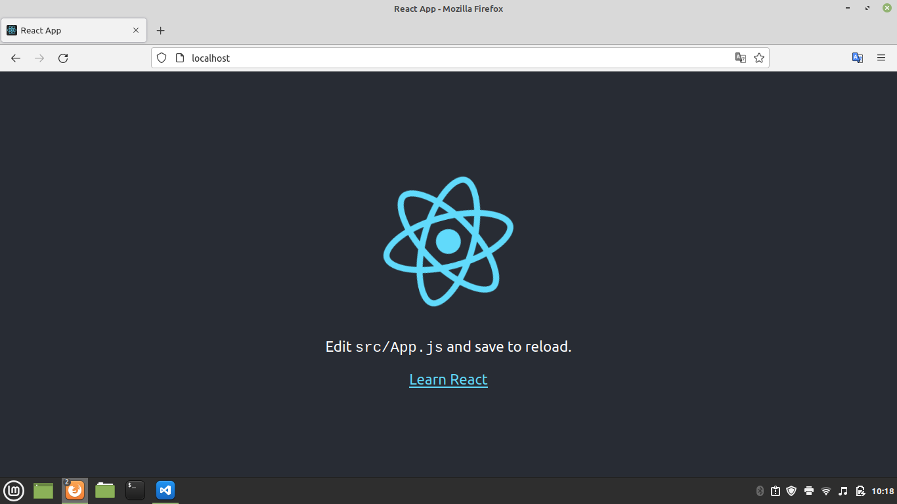

# Desafio Tech (DevOps)

## Descrição do Projeto

O foco do desafio é no deploy, contém um arquivo Dockerfile para realizar a build (construção da aplicação). O arquivo responsável por subir o container foi o Docker-compose contendo as demais informações (Ex. porta, nome, imagem, etc...). Foi utilizado NGINX para permitir o acesso através da porta 80 direcionando para a porta do container e realizado em uma máquina Linux.

```
✅  Deploy em React. Finalizado.  ✅
```
Imagens do desenvolvimento port:3001
<h1 align="center">
  
</h1>
Imagem de produção localhost
<h1 align="center">
  
</h1>
### Pré-requisitos

Antes de começar, você vai precisar ter instalado em sua máquina as seguintes ferramentas: [Git](https://git-scm.com), [Node.js](https://nodejs.org/en/). Além disto é bom ter um editor para trabalhar com o código como [VSCode](https://code.visualstudio.com/).

### Clone este repositório
```
$ git clone <https://github.com/julianasued/frexco.git>
```
### Acesse a pasta do projeto no terminal/cmd
```
$ cd my-app
```
### Instale as dependências
```
$ sudo apt install npm
```
## 🎲 Rodando container de Desenvolvimento

### Execute a aplicação em modo de desenvolvimento
```
$ sudo docker-compose -f docker-compose.dev.yml up
```
### O servidor inciará na porta:3001 - acesse <http://localhost:3001>

## 🎲 Rodando container de Produção

### Execute a imagem de produção
```
$ sudo docker-compose -f docker-compose.prod.yml build
```
### Execute a aplicação em modo de produção
```
$  sudo docker run -p 80:80 --name react-app app-prod
```
### O servidor inciará em localhost - acesse <http://localhost>

### 🛠 Tecnologias

As seguintes ferramentas foram usadas na construção do projeto:

-   [Node.js](https://nodejs.org/en/)
-   [React](https://pt-br.reactjs.org/)
-   [Docker](https://docker.com/get-started)

### ✅ Autor

Feito com por Juliana Sued 👋🏽 Entre em contato!

[](https://www.linkedin.com/in/juliana-sued-896b89206/) 
[](mailto:julianasuedcc@gmail.com)